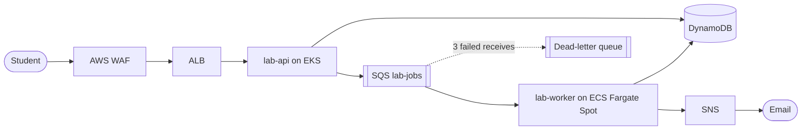
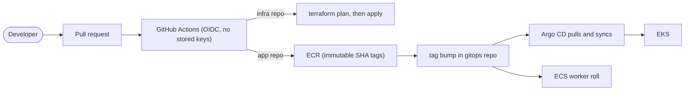
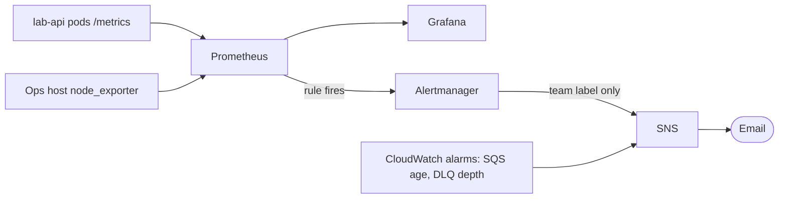

# cloud-lab-platform

A multi-environment AWS platform where **nothing changes without a pull request**.
Terraform builds identical dev, staging and prod environments from one module set, Argo CD keeps the
clusters matching Git, GitHub Actions deploys with **no stored AWS credentials**, and Prometheus alerts
before users notice a problem.

This is the **infrastructure repository** (Terraform, Ansible, and the infra pipelines). The platform
lives in three repositories, split by owner, change speed and blast radius:

| Repository | Holds |
|---|---|
| [cloud-lab-platform-infra](https://github.com/amerveus/cloud-lab-platform-infra) (this one) | Terraform modules and environments, Ansible, infra pipelines, ADRs, runbooks |
| [cloud-lab-platform-app](https://github.com/amerveus/cloud-lab-platform-app) | The API and worker source, tests, Dockerfiles, the app CI pipeline |
| [cloud-lab-platform-gitops](https://github.com/amerveus/cloud-lab-platform-gitops) | Kustomize base and overlays, Argo CD app-of-apps, platform add-ons |

## What it does

A small **lab-environment request service**. A student requests a lab, the request is stored, queued,
processed asynchronously, and the student is notified. The application is deliberately simple so the
engineering around it is the point.







The full diagram (editable) is in Eraser:
[cloud-lab-platform architecture](https://app.eraser.io/workspace/E4OVGVWT7DMDifNoiQTf?diagram=7FcDvh48eU23DUQikQpK).
A written walk-through is in [docs/architecture.md](docs/architecture.md).

## Where to look first

| If you care about... | Look at |
|---|---|
| Reusable Terraform, one blueprint for three environments | `modules/platform`, `envs/*`, [ADR-0001](docs/adr/0001-composition-module-three-environments.md) |
| Keyless CI and least-privilege roles | `bootstrap/iam-ci.tf`, [ADR-0003](docs/adr/0003-keyless-ci-oidc-plan-apply-roles.md) |
| An approval gate in front of production | `.github/workflows/terraform-apply.yml`, [ADR-0008](docs/adr/0008-production-promotion-and-teardown.md) |
| IaC scanning with a written risk register | `.trivyignore.yaml`, `.github/workflows/terraform-plan.yml` |
| Configuration management with no SSH | `ansible/`, `modules/ops-host` |
| Why each decision was made | [docs/adr](docs/adr) |
| How to operate and rebuild it | [docs/runbooks](docs/runbooks) |
| Evidence that it worked | [docs/evidence](docs/evidence/README.md) |

## Environments

All three call the same module. The diff between the environment folders is the whole story:

| | dev | staging | prod |
|---|---|---|---|
| VPC range | 10.10.0.0/16 | 10.20.0.0/16 | 10.30.0.0/16 |
| NAT gateways | 1 shared | 1 shared | 1 per AZ |
| Nodes (min / desired / max) | 2 / 3 / 4 | 2 / 2 / 3 | 3 / 3 / 5 |
| Table deletion protection | off | off | **on** |
| Resources (from the plan) | 106 | 106 | 110 |
| How it runs | applied by the pipeline on merge | plan-validated on every PR | applied only by a manual, approved run |

Region `us-east-1`, Kubernetes 1.36, `t3.small` nodes with VPC CNI prefix delegation (35 pods per node).

## Delivery pipelines (this repo)

**`terraform-plan`** runs on **every** pull request (no paths filter, so required checks always report):

1. Trivy IaC scan, run *before* `terraform init` so it judges our code, not downloaded module examples
2. `terraform fmt -check`, then `terraform validate` for all three environments
3. Read-only `terraform plan` for dev, staging and prod, posted as one comment each (updated in place)

**`terraform-apply`** runs when `envs/**` or `modules/**` changes on `main` (applies **dev**), or by manual
dispatch for **prod**. Prod runs in the `production` GitHub Environment: only `main` may deploy, a required
reviewer must approve, and admin bypass is off. Every run plans, saves the plan, and applies that file.

All third-party actions are pinned to commit SHAs. The runner image (`ubuntu-24.04`) and Terraform version are
pinned.

## Security model

- **No long-lived credentials.** CI assumes IAM roles through GitHub OIDC. The plan role is read-only and
  trusts only pull requests; the apply role trusts only the dev, staging and production environments.
- **Secret values never enter Terraform state.** Terraform creates the secret *containers*; values are set
  out-of-band, and External Secrets syncs them into the cluster.
- **Workload identity, not keys.** EKS Pod Identity for lab-api, the load balancer controller, External
  Secrets and Alertmanager; an ECS task role for the worker.
- **Private by default.** Nodes, Fargate tasks and the ops host are in private subnets. The ops host has no
  key pair and no inbound port; it is reached only through Systems Manager.
- **Hardened workloads.** Pod Security `restricted`, non-root, read-only root filesystem, dropped
  capabilities; IMDSv2 required on EC2.
- **Defense in depth on the public edge.** WAF rate limit and managed rules, a token-gated fault-injection
  endpoint that returns 404 otherwise, and budget alarms.

## Measured results

Numbers measured during the build (Sep 23 to Oct 8, 2026), not targets:

| Outcome | Result |
|---|---|
| Long-lived AWS keys in CI | **0** (OIDC) |
| Environments from one module set | **3** (dev applied, staging plan-validated, prod applied once) |
| Prod apply, end to end | 110 resources in **15m34s**, through the approval gate |
| Drift reverted by Argo CD | scaled to 5 by hand, back to 2 in **about 1 second** |
| Vulnerable image blocked | **yes**: HIGH `libpcre2` CVE caught by Trivy and patched at the source |
| Ansible idempotency | first run `changed=10`, second run **`changed=0`** |
| Alert latency | first error to inbox in about **3 minutes** (2 minute `for:` window plus grouping) |
| Rollout under load | **50 of 50** requests returned 200 while both pods were replaced |
| WAF rate limit | 250-request burst allowed, then **403** once the rule engaged |
| Same artifact in dev and prod | identical image digest (`sha256:67797c49...`) in both clusters |
| Teardown | dev (106) and prod (110) destroyed; account verified empty by direct checks |

## Repository layout

```
bootstrap/        one-time layer: state bucket, GitHub OIDC, CI roles, shared ECR, budget
modules/
  platform/       composition module: VPC, EKS, add-on IAM, WAF, secrets, monitoring IAM
  data/           DynamoDB table
  messaging/      SQS, DLQ, SNS, CloudWatch alarms
  workload-iam/   Pod Identity role and association for lab-api
  ecs-worker/     ECS cluster, task and execution roles, Fargate Spot service, autoscaling
  ops-host/       SSM-only EC2 host and its transfer bucket
envs/
  dev/ staging/ prod/   thin roots: only what differs
ansible/          dynamic EC2 inventory, SSM connection, baseline and node_exporter roles
docs/
  adr/            architecture decision records
  runbooks/       operating procedures
  evidence/       screenshots and what they prove
.github/workflows/  terraform-plan.yml, terraform-apply.yml
.trivyignore.yaml   accepted IaC findings: path-scoped, justified, expiring
```

## Running it

Prerequisites: Terraform 1.11 or newer, AWS CLI v2, `gh`, `kubectl`, `helm`, Ansible, and the AWS
`session-manager-plugin`.

1. **Bootstrap once** (local state first, then migrated into the bucket it creates):
   `cd bootstrap && terraform init && terraform apply`, then
   `terraform init -backend-config=backend.hcl -migrate-state`.
2. **Configure GitHub:** create the `dev` and `production` Environments (production: required reviewer,
   `main` only, admin bypass off), set the repository variables `AWS_PLAN_ROLE_ARN`, `AWS_APPLY_ROLE_ARN`,
   `TF_AZS`, `TF_KUBERNETES_VERSION`, `TF_CLUSTER_ADMIN_ARNS` and the secrets `TF_ADMIN_CIDRS`,
   `TF_ALERT_EMAIL`.
3. **Merge to `main`** (or dispatch `terraform-apply` for `dev`). The pipeline builds the environment.
4. **Bring up GitOps and the add-ons** with [docs/runbooks/rebuild-dev.md](docs/runbooks/rebuild-dev.md).

## Cost

About **$6 to $7 per day** while an environment is up (EKS control plane, NAT gateways, three `t3.small`
nodes, ALB, WAF). The account has a monthly budget with alerts at 75 and 100 USD actual and a 100 USD
forecast alert. Environments are torn down when not in use: see
[docs/runbooks/teardown.md](docs/runbooks/teardown.md). Prod was applied for roughly 90 minutes.

## Things that broke, and what they taught

| What happened | Takeaway |
|---|---|
| Trivy blocked a real HIGH CVE in the Debian layer | Patch the base image; never weaken the gate |
| First push failed to assume the CI role | GitHub sends immutable subjects with numeric IDs. Read the token in CloudTrail instead of guessing |
| A job waited about 10 minutes on an idle queue | SQS stops publishing metrics for idle queues; alarm-based scale-from-zero is blind. Keep a warm minimum |
| A rolling restart returned 504s through the ALB | Kubernetes marked pods ready before the ALB did. Add readiness gates, a preStop sleep and a deregistration delay |
| Plan showed a KMS key policy flipping between laptop and CI | The EKS module makes whoever runs Terraform the key admin. Name the administrators explicitly |
| A plan showed 6 updates after marking a variable sensitive | "Known after apply" is not "will change". Trace the cascade before applying |
| A secret value sat in Terraform state | The read-only plan role can read state, and any PR can assume it. Keep values out of state and rotate |
| I put a ServiceMonitor in the shared base | Prod had no Prometheus CRDs. The base holds only what every environment can run |

## Known limitations and next steps

- The prod approval fires before the plan is computed. Next: separate plan and apply jobs and apply the saved
  plan artifact after approval.
- A rebuild invalidates three values hard-coded in the gitops repo (VPC id, WAF ACL ARN, ops host IP). Next:
  drive them from Terraform outputs.
- The prod worker was promoted by hand. Next: a gated `deploy-worker-prod` job.
- There is no destroy workflow on purpose; teardown is a documented break-glass procedure.
- The API accepts anonymous writes (WAF-limited). Real use needs authentication.
- The API writes DynamoDB then SQS without a transaction. Next: a transactional outbox
  (DynamoDB Streams, EventBridge Pipe, SQS).
- Prod does not run the load balancer controller, External Secrets or monitoring yet.
- The ratio alert should exclude `/metrics` and require a minimum request rate.
